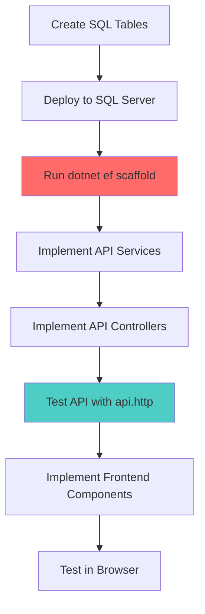

# Implementation Breakdown: Database-First Todo App

**Generated**: October 28, 2025  
**Total Tasks**: 154 tasks  
**Recommended Approach**: Database → API → Frontend (per layer, per user story)

---

## Quick Start: MVP Path (78 tasks)

For fastest time-to-value, implement **P1 stories only** (US1 + US2):

### Week 1: Foundation (30 tasks)

**Phase 1: Setup (7 tasks, ~2 hours)**
```bash
# T001-T007: Prerequisites, Azure AD config, SQL setup, npm install
Day 1 Morning: Complete all setup tasks
```

**Phase 2: Foundational - Database Layer (7 tasks, ~3 hours)**
```bash
# T008-T014: Create database schema
Day 1 Afternoon:
- Create Users, Tasks, TaskShares tables
- Add indexes, constraints, triggers
- Deploy to SQL Server
```

**Phase 2: Foundational - API Layer (9 tasks, ~3 hours)**
```bash
# T015-T023: Scaffold & configure API
Day 2 Morning:
- Scaffold EF Core entities (T015) - CRITICAL after DB deploy
- Configure authentication, CORS, error handling, resilience
- Setup Swagger
```

**Phase 2: Foundational - Frontend Layer (7 tasks, ~3 hours)**
```bash
# T024-T030: Configure Angular app
Day 2 Afternoon:
- Configure MSAL authentication
- Create interceptors, guards, base services
- Setup routing
```

### Week 2: User Story 1 - Authentication (16 tasks)

**API Layer (5 tasks, ~2 hours)**
```bash
# T031-T035: User profile endpoint
Day 3 Morning:
- Create DTOs, services, controller
- Implement GET /api/users/me
```

**Frontend Layer (7 tasks, ~4 hours)**
```bash
# T036-T042: Auth UI
Day 3 Afternoon + Day 4 Morning:
- Login/logout components
- Auth service, user service
- Profile display, navigation header
```

**Testing (4 tasks, ~2 hours)**
```bash
# T043-T046: Integration validation
Day 4 Afternoon:
- Test full auth flow
- Verify auto-provisioning
```

### Week 3-4: User Story 2 - Personal Tasks (32 tasks)

**API Layer (14 tasks, ~6 hours)**
```bash
# T047-T060: Task CRUD
Day 5-6:
- Create all DTOs (T047-T051) - can parallelize
- Implement TaskService (T052-T053)
- Create TasksController with all endpoints (T054-T060)
  - GET /api/tasks (list with pagination)
  - POST /api/tasks (create)
  - GET /api/tasks/{id}
  - PUT /api/tasks/{id}
  - PATCH /api/tasks/{id}/status
  - DELETE /api/tasks/{id}
```

**Frontend Layer (12 tasks, ~8 hours)**
```bash
# T061-T072: Task management UI
Day 7-9:
- Task service, list, card, form components
- Status badges, filtering, sorting, pagination
- Edit/delete actions
- Tailwind styling
```

**Testing (6 tasks, ~3 hours)**
```bash
# T073-T078: Comprehensive validation
Day 10:
- Test full CRUD lifecycle
- Test pagination, filtering, sorting
- Verify ownership enforcement
```

🎯 **MVP Checkpoint**: After 78 tasks, you have a fully functional personal task manager with authentication!

---

## Extended Features: P2 and P3 Stories

### User Story 3 - Task Sharing (31 tasks, ~2 weeks)

**API Layer (13 tasks)**
- T079-T091: Share/revoke endpoints, shared task list

**Frontend Layer (10 tasks)**
- T092-T101: Share modal, share list, read-only indicators

**Testing (8 tasks)**
- T102-T109: Share flow, read-only enforcement, revoke

### User Story 4 - Dashboard (20 tasks, ~1 week)

**API Layer (3 tasks)**
- T110-T112: Enhanced filtering and sorting

**Frontend Layer (10 tasks)**
- T113-T122: Dashboard layout, filters, grouped views

**Testing (7 tasks)**
- T123-T129: Dashboard functionality validation

### Phase 7 - Polish (25 tasks, ~1 week)

**Resilience (6 tasks)**
- T130-T135: Loading states, notifications, polling, retry testing

**Security (5 tasks)**
- T136-T140: Validation, CORS, rate limiting, token expiration

**Documentation (5 tasks)**
- T141-T145: READMEs, comments, API docs, quickstart validation

**Testing (5 tasks, optional)**
- T146-T150: Unit tests if time permits

**Final Validation (4 tasks)**
- T151-T154: End-to-end tests, performance, security

---

## Critical Path: Database-First Workflow

### The Golden Rule
**Always: Database → Scaffold → API → Frontend**

### Workflow Steps



### Schema Change Process

When you need to modify the database:

```bash
# 1. Update SQL table definition
code src/database/Tables/Tasks.sql

# 2. Deploy changes to SQL Server
# (via SSDT publish or manual script execution)

# 3. RE-SCAFFOLD entities (CRITICAL!)
cd src/api
dotnet ef dbcontext scaffold \
  "Server=localhost;Database=TodoDB;User ID=sa;Password=YourPass;" \
  Microsoft.EntityFrameworkCore.SqlServer \
  -o Data/Entities \
  -c TodoDbContext \
  --context-dir Data \
  --force \
  --use-database-names \
  --no-onconfiguring

# 4. Update partial classes or Fluent API if needed
# (NEVER edit generated entity files directly)

# 5. Update API services/controllers if needed

# 6. Update frontend models if DTOs changed
```

---

## Layer-by-Layer Implementation Guide

### Database Layer Checklist

For each user story, complete database first:

- [ ] **US1**: Users table (T008)
- [ ] **US2**: Tasks table (T009)
- [ ] **US3**: TaskShares table (T010)
- [ ] All constraints, indexes, triggers (T011-T012)
- [ ] Deploy schema (T014)
- [ ] **CRITICAL**: Run scaffold command (T015)

### API Layer Checklist

For each endpoint, follow this order:

1. **DTOs** (data contracts) - can parallelize
2. **Service Interface** (define operations)
3. **Service Implementation** (business logic)
4. **Controller** (HTTP endpoints)
5. **Test with api.http** (manual verification)

Example for US2 Tasks:
```bash
# Step 1: DTOs (parallel)
T047: TaskDto.cs
T048: CreateTaskDto.cs
T049: UpdateTaskDto.cs
T050: UpdateTaskStatusDto.cs
T051: PagedTaskListDto.cs

# Step 2: Service Interface
T052: ITaskService.cs

# Step 3: Service Implementation
T053: TaskService.cs (implements CRUD + ownership checks)

# Step 4: Controller
T054-T060: TasksController.cs with all endpoints

# Step 5: Test
T078: Update api.http with all task endpoints
```

### Frontend Layer Checklist

For each feature, follow this order:

1. **Service** (API client)
2. **Core Components** (display logic)
3. **Form Components** (user input)
4. **Styling** (Tailwind CSS)
5. **Integration** (routing, guards)
6. **Test** (browser validation)

Example for US2 Tasks:
```bash
# Step 1: Service
T061: task.service.ts

# Step 2: Display Components
T062: task-list.component.ts
T063: task-card.component.ts
T065: status-badge.component.ts

# Step 3: Form Components
T064: task-form.component.ts

# Step 4: Features
T066-T070: Filtering, sorting, pagination, actions

# Step 5: Styling
T071: Tailwind CSS styling

# Step 6: Error Handling
T072: Loading states, error messages

# Step 7: Test
T073-T077: Browser testing
```

---

## Team Coordination Strategies

### Solo Developer: Sequential by Phase

```
Week 1: Setup + Foundational (all layers)
Week 2: US1 (Database → API → Frontend)
Week 3-4: US2 (Database → API → Frontend)
```

**Pros**: Clear progress, fewer context switches
**Cons**: Slower time-to-market

### 2 Developers: API-Frontend Split

```
Developer A (Backend):
- Setup + DB + API scaffolding
- US1 API → US2 API → US3 API

Developer B (Frontend):
- Setup + Frontend foundation
- US1 Frontend → US2 Frontend → US3 Frontend
```

**Sync Points**:
- After foundational phase complete
- After each user story API complete (enables frontend work)

**Pros**: Parallel progress after foundation
**Cons**: Requires good API contracts, coordination on schema changes

### 3+ Developers: Story-Based Split

```
All Developers: Setup + Foundational (2-3 days)

Then split:
Developer A: US1 (full stack)
Developer B: US2 (full stack, after US1 API basics)
Developer C: US3 (full stack, after US2 API basics)
```

**Pros**: Each developer owns a complete feature
**Cons**: More merge conflicts, schema coordination critical

---

## Parallel Execution Opportunities

### High-Confidence Parallel Tasks

These tasks can safely run in parallel (different files, no dependencies):

**Phase 1 Setup**:
- T002 (Azure AD) + T003 (SQL) + T004 (User Secrets) + T005 (npm) + T006 (Tailwind) + T007 (environments)

**Phase 2 DTOs** (after API scaffolding):
- T022 (ErrorResponse.cs) + T029 (Frontend models) - different projects

**US2 DTOs**:
- T047, T048, T049, T050, T051 - all different DTO files

**US2 Frontend Components** (after service ready):
- T062 (task-list) + T063 (task-card) + T065 (status-badge) - independent components

**US3 DTOs**:
- T079, T080, T081, T082 - all different DTO files

**US3 Frontend** (after service ready):
- T092 (task-share.service) + T093 (shared-tasks-list)

**Phase 7 Tests**:
- T146, T147, T148, T149, T150 - all independent test files

### Caution: Sequential Dependencies

These tasks MUST be sequential:

1. **T008-T014 → T015**: Database deploy THEN scaffold
2. **T015 → T016-T023**: Scaffold THEN configure API
3. **T031-T035 → T036-T042**: API endpoints THEN frontend for US1
4. **T047-T060 → T061-T072**: API endpoints THEN frontend for US2
5. **T079-T091 → T092-T101**: API endpoints THEN frontend for US3

---

## Testing Strategy

### Manual Testing Priority

Since automated tests are not explicitly requested, focus on:

1. **API Testing with api.http** (Visual Studio Code REST Client)
   - After each controller implementation
   - Test success cases
   - Test error cases (401, 403, 404, 400)
   
2. **Browser Testing**
   - After each frontend component
   - Use Chrome DevTools for debugging
   - Test responsive design (mobile, tablet, desktop)

3. **Checkpoint Testing** (after each user story)
   - US1: Full auth flow
   - US2: Complete task lifecycle
   - US3: Share and revoke flow
   - US4: Dashboard filtering

### Automated Testing (Phase 7, Optional)

If time permits, add tests in this order:

1. **Unit Tests** (T146-T148): Service layer logic
2. **Integration Tests** (T149): API endpoints with TestServer
3. **Frontend Tests** (T150): Jest unit tests for key components

Priority: Service tests > Integration tests > Frontend tests

---

## Common Issues & Solutions

### Issue: Scaffold fails after database changes

**Solution**:
```bash
# Verify connection string
dotnet ef dbcontext list

# Check database deployed
# Use Azure Data Studio to confirm tables exist

# Re-run scaffold with --force
dotnet ef dbcontext scaffold "<ConnectionString>" \
  Microsoft.EntityFrameworkCore.SqlServer \
  -o Data/Entities -c TodoDbContext --context-dir Data \
  --force --use-database-names --no-onconfiguring
```

### Issue: Entity properties not matching database

**Cause**: Using old scaffolded entities

**Solution**:
```bash
# Delete existing generated files
rm -rf src/api/Data/Entities/*
rm src/api/Data/TodoDbContext.cs

# Re-scaffold
dotnet ef dbcontext scaffold ...
```

### Issue: Frontend gets 401 Unauthorized

**Checklist**:
- [ ] Azure AD app registrations created correctly
- [ ] API ClientId matches in appsettings.json
- [ ] Frontend ClientId matches in environment.ts
- [ ] Scope `api://todo-api/Tasks.ReadWrite` configured
- [ ] Token acquired in frontend (check browser DevTools)
- [ ] Token sent in Authorization header (check Network tab)

### Issue: CORS errors in browser

**Solution**:
```csharp
// In src/api/Program.cs
builder.Services.AddCors(options =>
{
    options.AddDefaultPolicy(policy =>
    {
        policy.WithOrigins("http://localhost:4200")
              .AllowAnyMethod()
              .AllowAnyHeader();
    });
});

// Before app.MapControllers()
app.UseCors();
```

### Issue: Shared task not visible to recipient

**Debug Steps**:
1. Check TaskShare record created in database
2. Verify SharedWithUserId matches recipient's User.Id
3. Check GET /api/shared-tasks includes the task
4. Verify recipient is logged in as correct user
5. Check frontend service making correct API call

---

## Progress Tracking

### Daily Standup Questions

1. **Yesterday**: Which tasks completed? (use task IDs: T001, T002, etc.)
2. **Today**: Which tasks planned? (from tasks.md)
3. **Blockers**: Waiting on database deploy? API endpoints? Other developer?

### Weekly Milestones

**Week 1**: Setup + Foundational complete (T001-T030) ✅
**Week 2**: US1 complete (T031-T046) ✅ → Can authenticate
**Week 3-4**: US2 complete (T047-T078) ✅ → MVP ready
**Week 5**: US3 complete (T079-T109) ✅ → Sharing works
**Week 6**: US4 complete (T110-T129) ✅ → Dashboard ready
**Week 7**: Polish complete (T130-T154) ✅ → Production ready

### Definition of Done (per User Story)

- [ ] All tasks in phase checked off in tasks.md
- [ ] API endpoints return correct status codes (200, 201, 204, 400, 401, 403, 404)
- [ ] API endpoints tested with api.http file
- [ ] Frontend displays data correctly
- [ ] Frontend handles loading and error states
- [ ] Independent test criteria passed (from checkpoint)
- [ ] Code committed to feature branch
- [ ] Documentation updated (README, comments)

---

## Key Takeaways

### Database-First Philosophy

✅ **DO**:
- Create database tables first
- Deploy schema changes immediately
- Re-scaffold after every schema change
- Use partial classes for entity extensions
- Commit SQL scripts to version control

❌ **DON'T**:
- Edit generated entity files
- Use code-first migrations
- Skip re-scaffolding after schema changes
- Manually sync C# models with database

### Architecture Layers

**Database (Source of Truth)**
→ **EF Core Entities (Generated)**
→ **DTOs (API Contracts)**
→ **Services (Business Logic)**
→ **Controllers (HTTP Endpoints)**
→ **Frontend Services (API Clients)**
→ **Components (UI)**

### MVP Strategy

Focus on US1 + US2 first:
- Delivers core value (authentication + task management)
- Validates architecture choices
- Provides early feedback
- Enables iterative development

Add US3 + US4 only after MVP validated.

---

## Quick Reference Commands

```bash
# Database scaffolding
cd src/api
dotnet ef dbcontext scaffold "Server=localhost;Database=TodoDB;User ID=sa;Password=Pass;" \
  Microsoft.EntityFrameworkCore.SqlServer \
  -o Data/Entities -c TodoDbContext --context-dir Data \
  --force --use-database-names --no-onconfiguring

# Run API
cd src/api
dotnet run
# https://localhost:5001/swagger

# Run Frontend
cd src/front
npm start
# http://localhost:4200

# Run Tests (if implemented)
cd tests/api.tests
dotnet test

cd src/front
npm test
```

---

**Generated**: October 28, 2025  
**Next Steps**: Start with Phase 1 (T001-T007) from tasks.md
